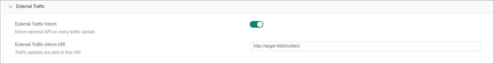

# 3xui-exporter

[3X-UI](https://github.com/MHSanaei/3x-ui) traffic counter exporter with prometheus syntax. Written in Go

## License

[MIT](https://choosealicense.com/licenses/mit/)

## Usage
TODO...

## Metric collect

{x3-ui_url}/panel/settings > External traffic > Add the host

## {node}/metrics - output
TODO...

## Prometheus job
TODO...